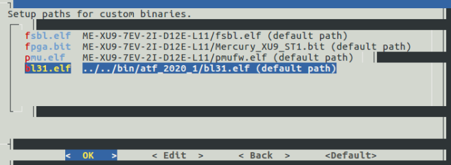

# 1 - Workflow
This chapter describes the basic workflow for Xilinx and Intel SoC.

## 1.1 - Modules equipped with Xilinx SoC

### 1.1.1 Required files
* **FPGA bitstream (fpga.bit)**
  
  The FPGA bitstream needs to be generated in Xilinx Vivado according to section **FPGA Bitstream Generation** of the reference design manual of the target module.

* **First stage boot loader (fsbl.elf)**
  
  The FSBL binary is generated in Xilinx SDK according to section **First Stage Boot Loader (FSBL) Application** of the reference design manual.

* **PMU firmware (pmu.elf)**
  
  Enclustra modules equipped with a Xilinx Ultrascale+ MPSoC device require a PMU firmware. This PMU firmware can be built in Xilinx SDK in the same manner as the FSBL. A link with the description of how to build the PMU Firmware can be found in section [1.3](Chapter-1-Workflow.md#13-additional-information).

* **ARM Trusted Firmware (bl31.elf)**
  
  Enclustra modules equipped with a Xilinx Ultrascale+ MPSoC require the ARM Trusted Firmware (bl31.elf). A link with the description of how to build the ARM Trusted Firmware can be found in section [1.3](Chapter-1-Workflow.md#13-additional-information). This software needs to be built only once since it does not contain any information about the user design.

### 1.1.2 Generate boot files
Once the FPGA bitstream and the needed binaries are built, the required boot files can be generated using the Enclustra build environment. The procedure is explained in the build environment documentation (link provided in section [1.3](Chapter-1-Workflow.md#13-additional-information)) and in more detail in the following paragraphs.

- Clone the [bsp-xilinx git repository](https://github.com/enclustra-bsp/bsp-xilinx)
- Navigate to the root directory of the previously cloned repository
- Start the `build.sh` script to generate a Linux build for the target module
- In the `Setup paths for custom binaries` menu set the path to the manually generated first stage bootloader (fsbl.elf) and the path to the manually generated FPGA bitstream (fpga.bit). For Enclustra modules equipped with Xilinx Ultrascale+ MPSoC devices, the PMU firmware (pmu.elf) is also required.

    

- After the build was successful, the generated binaries can be found in the output directory

If the binaries have been updated but no other changes occured in the code (for example for Linux or Rootfs) or in the processing system that would require updating the device tree, it is possible to regenerate the `boot.bin` file without the build script. The tool used to generate the `boot.bin` file is located at
`<path_to_build_environment>/bin/mkbootimage/`. The steps required to regenerate the boot binary are:

- Copy the first stage bootloader to the output directory and rename it to `fsbl.elf` (for example to `out_20180914164627_Zynq-Ultrascale+_Mercury_XU5_Mercury_PE1_MMC`)
- Copy the FPGA bitstream to the output directory and rename it to `fpga.bit`
- **Only for Enclustra modules equipped with Xilinx Ultrascale+ MPSoC devices**: Copy the PMU firmware to the output directory and rename it to `pmu.elf`.
- Go to the output directory and execute the following line to generate the `boot.bin` according to the instructions in the `boot.bif` file:
  - For Enclustra modules equipped with Zynq-7000 SoC devices:
    ```
    ../bin/mkbootimage/mkbootimage boot.bif boot.bin
    ```
  - For Enclustra modules equipped with Xilinx Ultrascale+ MPSoC devices
    ```
    ../bin/mkbootimage/mkbootimage --zynqmp boot.bif boot.bin
    ```
- The newly generated `boot.bin` can be found in the output directory

## 1.2 - Modules equipped with Intel SoC

### 1.2.1 - Required files

- **FPGA bistream (fpga.rbf)**
  
    The FPGA bitstream needs to be generated using Intel Quartus according to section `FPGA Bitstream Generation` of the reference design manual of the target module.

- **Preloader (uboot-mkimage.bin)**

    The preloader is generated according to section `Preloader Generation` of the reference design manual.

### 1.2.2 - Generate boot files
Once the FPGA bitstream and preloader binary are build, the required boot files can be generated using the Enclustra build environment. The procedure is explained in the build environment documentation (link provided in section [1.3](Chapter-1-Workflow.md#13-additional-information)) and in more detail in the following paragraphs.

- Clone the [bsp-altera git repository](https://github.com/enclustra-bsp/bsp-altera)
- Navigate to the root directory of the previously cloned repository
- Start the `build.sh` script to generate a Linux build for the target module
- In the `Setup paths for custom binaries` menu set the path to the manually generated preloader (`preloader-mkimage.bin`) and the path to the manually generated FPGA bitstream (fpga.rbf)
- After the build was successful, the generated binaries can be found in the output directory

Since no additional binary is required as for example the `boot.bin` in the Xilinx workflow, the bitstream and preloader can be replaced on the boot storage without running the build script.

When booting from the SD card or from the eMMC flash, the preloader must be recorded to an unformatted partition of type a2 (see [EBE for modules equipped with Intel SoC](https://enclustra.github.io/ebe-docs/user-doc-altera/index_altera.html) documentation).
For QSPI boot, the FPGA bitstream needs to be converted into a ’.rbf.img’ file. This can be done as follows:
- Open `SoC EDS Command shell`
- Navigate to the directory the bitstream file is stored
- If required, convert the SRAM object file (.sof) to a raw binary file (.rbf) using the following command:
  ```
  quartus_cpf −c <name_of_bitstream>.sof <name_of_bitstream>.rbf
  ```
- Convert the `.rbf` file to a `.rbf.img` file by executing following command:
  ```
  mkimage −A arm −T standalone −C none −a 0 −e 0 −n ”fpga image” −d name_of_bitstream>.rbf <name_of_bitstream>.rbf.img
  ```

## 1.3 Additional information
* [EBE for modules equipped with Intel SoC](https://enclustra.github.io/ebe-docs/user-doc-altera/index_altera.html)
* [EBE for modules equipped with Xilinx SoC](https://enclustra.github.io/ebe-docs/user-doc-xilinx/index_xilinx.html)
* [Xilinx Wiki: Build PMU Firmware](https://xilinx-wiki.atlassian.net/wiki/spaces/A/pages/18842462/Build+PMU+Firmware)
* [Xilinx Wiki: Build ARM Trusted Firmware (ATF)](https://xilinx-wiki.atlassian.net/wiki/spaces/A/pages/18842305/Build+ARM+Trusted+Firmware+ATF)

**Please continue reading [Chapter 2 - U-Boot](./Chapter-2-U-Boot.md).**