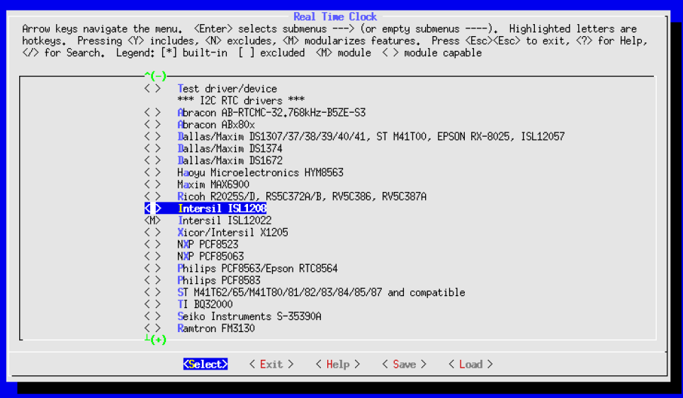

# 3 - Linux kernel

## 3.1 - Folder structure
The following trees show the folder structure starting from top level directory ([bsp-xilinx](https://github.com/enclustra-bsp/bsp-xilinx) or [bsp-altera](https://github.com/enclustra-bsp/bsp-altera)) of the [Enclustra Build Environment (EBE)](https://www.enclustra.com/en/products/tools/linux-build-environment/). All paths and files mentioned in this Kernel section are shown below.

### 3.1.1 Linux kernel for Intel devices
```
└── bsp-altera/
    └── sources
        ├── altera-uboot
        ├── buildroot-rootfs
        └── altera-linux
            ├── .config
            ├── defconfig
            ├── Makefile
            ├── arch
            │   └── arm
            │       ├── configs
            │       │   └── socfpga_defconfig 
            │       └── boot
            │           └── dts
            │               ├── socfpga_cyclone5_mars_ma3.dts
            │               ├── socfpga_cyclone5_mercury_sa1.dts
            │               ├── socfpga_cyclone5_mercury_sa2.dts
            │               └── socfpga_arria10_mercury_aa1.dts
            ├── Documentation
            │   └── devicetree
            │       └── bindings
            └── drivers
                └── staging
                    ├── Kconfig
                    ├── Makefile
                    └── helloWorld
                        ├── Kconfig
                        ├── Makefile
                        └── hello_world.c
```
### 3.1.2 Linux kernel for Xilinx devices
```
└── bsp-xilinx/
    └── sources
        ├── xilinx-uboot
        ├── buildroot-rootfs
        └── xilinx-linux
            ├── .config
            ├── defconfig
            ├── Makefile
            ├── arch
            │   └── arm
            │       ├── configs
            │       │   └── xilinx_zynq_defconfig 
            │       └── boot
            │           └── dts
            │               ├── zynq-mercury-zx1.dts
            │               ├── zynq-mars-zx2.dts
            │               ├── zynq-mars-zx3.dts
            │               ├── zynq-mercury-zx5.dts
            │               └── zynq-cosmos-xzq10.dts
            │   └── arm64
            │       ├── configs
            │       │   └── xilinx_zynqmp_defconfig 
            │       └── boot
            │           └── dts
            │               └── xilinx
            │                   ├── zynqmp-enclustra-xu1.dts
            │                   ├── zynqmp-enclustra-xu3.dts
            │                   ├── zynqmp-enclustra-xu5.dts
            │                   ├── zynqmp-enclustra-xu7.dts
            │                   └── zynqmp-enclustra-xu8.dts
            ├── Documentation
            │   └── devicetree
            │       └── bindings
            └── drivers
                └── staging
                    ├── Kconfig
                    ├── Makefile
                    └── helloWorld
                        ├── Kconfig
                        ├── Makefile
                        └── hello_world.c
```
## 3.2 - Configuration
There are several ways to configure the Linux kernel:

| Command         | Description                                |
|-----------------|--------------------------------------------|
| make config     | A simple question-and-answer-based utility |
| make xconfig    | Graphical interface, requires Qt           |
| make gconfig    | Graphical interface, uses GTK+             |
| make menuconfig | Graphical interface, needs ncurses package |
| make nconfig    | Similar to make menuconfig                 |

This section only explains the usage of `make menuconfig`, since it is commonly used.
Because Linux for the Enclustra modules is cross compiled, the `ARCH` environment variable must be set correctly, before `make menuconfig` is called. This can be done with the following command:

For Intel and Xilinx Zynq-7000 SoC:
```
export ARCH=arm
```
For Xilinx Ultrascale+ MPSoC:
```
export ARCH=arm64
```
The configuration GUI can only be started in the kernel source directory. In the [Enclustra Build Environment (EBE)](https://www.enclustra.com/en/products/tools/linux-build-environment/), the kernel sources can be found in the `<path_to_build_environment>/sources/altera-linux` or the `<path_to_build_environment>/sources/xilinx-linux` subfolder, depending on the FPGA vendor of the target module. If project mode is used, the kernel sources can be found in the generated output directory (e.g. `<path_to_build_environment>/out_20180815152934_Mercury_SA1_Mercury_PE1_MMC/altera-linux`). After the target architecture was set, the graphical menu can be started by calling:
```
make menuconfig
```


The graphical menu can be used to enable/disable drivers or to add/remove new features to the kernel. The cursor keys are used to navigate through the menu. Space is used to add a selected driver `<*>` as part of the monolithic kernel, add it as a loadable module `<M>` or to remove it `< >`. By typing `/` a search menu opens that allows the user to search for a specific driver or feature. If `?` is pressed, some additional information of the currently selected entry is shown. When leaving the graphical menu, the user has the option to save the changed configuration or to discard all previously made changes. When the configuration is saved, the configuration is written to the file `.config` in kernel source directory.

### 3.2.1 Defconfig files
Because every new kernel version brings new options and additional configuration parameters, the previous kernel configuration file (.config) can’t be used to transfer the kernel settings to a newer kernel version. `defconfig` files were added to solve this problem so that the configuration file doesn’t need to be changed each time the kernel is updated. Defconfig files store only specific options with non-default values (e.g. options that were changed for Enclustra modules).

The following files were used for Enclustra modules:

| Modules                             | Path                                       |
|-------------------------------------|--------------------------------------------|
| Modules with Intel SoC              | arch/arm/configs/socfpga_defconfig         |
| Modules with Zynq-7000 SoC          | arch/arm/configs/xilinx_zynq_defconfig     |
| Modules with Zynq-Ultrascale+ MPSoC | arch/arm64/configs/xilinx_zynqmp_defconfig |

A configuration can be applied for example by executing:
```
make xilinx_zynq_defconfig
```
When the defconfig file is applied, the configuration is written to the `.config` file, which stores all configuration parameters, even the ones with default values. If needed, new configuration files can be created, containing the desired configuration. Because the kernel build system keeps a specific order for the kernel settings in the defconfig files, it should be avoided to modify a defconfig file by hand. The following command can be used to generate a defconfig file using the current kernel configuration.
```
make savedefconfig
```
This command creates a new file named `defconfig` in kernel source directory.

### <a name="322BuildKernelWithoutEnclustraBuildScript"></a>3.2.2 Build kernel without Enclustra build script
This section explains how to build the kernel binary files without using the build script of the Enclustra build environment.

**Prepare environment**

Before the binaries can be built, the environment needs to be prepared accordingly. The following code shows the needed preparation depending on the architecture of the target module.

For Intel SoC or Xilinx Zynq-7000 SoC:
```
cd <path_to_build_environment>
export PATH=$PATH:$(pwd)/bin/arm−none−linux−gnueabi−static/bin/
export ARCH=arm
export CROSS_COMPILE=arm−none−linux−gnueabi−
```
For Xilinx Zynq Ultrascale+ MPSoC:
```
cd <path_to_build_environment>
export PATH=$PATH:$(pwd)/bin/aarch64−none−linux−gnueabi/bin/
export PATH=$PATH:$(pwd)/bin/arm−none−linux−gnueabi−static/bin/
export ARCH=arm64
export CROSS_COMPILE=aarch64−none−linux−gnueabi−
export CROSS32CC=arm−none−linux−gnueabi−gcc
```

**Build kernel binary**

To build the kernel binary, the following command needs to be executed in the kernel source directory. Note that `LOADADDR` is the offset of the physical RAM where the kernel is loaded.

For Intel SoC:
```
cd <path_to_build_environment>/sources/altera−linux
make LOADADDR=0x8000 uImage −j8
```
For Xilinx Zynq-7000 SoC:
```
cd <path_to_build_environment>/sources/xilinx−linux
make LOADADDR=0x8000 uImage −j8
```
For Xilinx Zynq Ultrascale+ MPSoC:
```
cd <path_to_build_environment>/sources/xilinx−linux
make Image −j8
```
If the build was successful, the newly generated kernel binary can be found in following location:

| Modules                           | Path                  |
|-----------------------------------|-----------------------|
| Intel SoC or Xilinx Zynq-7000 SoC | arch/arm/boot/uImage  |
| Xilinx Zynq Ultrascale+ MPSoC     | arch/arm64/boot/Image |

**Build Device Tree Blob (DTB)**

The device tree source files are compiled into a device tree blob file by executing following command in kernel source directory.
```
make dtbs −j8
```
The built device tree blob files can be found in the same directory as the device tree source files:

| Altera SoC   |                                                    |
|--------------|----------------------------------------------------|
| Mars MA3     | arch/arm/boot/dts/socfpga_cyclone5_mars_ma3.dtb    |
| Mercury SA1  | arch/arm/boot/dts/socfpga_cyclone5_mercury_sa1.dtb |
| Mercury+ SA2 | arch/arm/boot/dts/socfpga_cyclone5_mercury_sa2.dtb |
| Mercury+ AA1 | arch/arm/boot/dts/socfpga_arria10_mercury_aa1.dtb  |

| Xilinx Zynq-7000 SoC |                                         |
|----------------------|-----------------------------------------|
| Mercury ZX1          | arch/arm/boot/dts/zynq-mercury-zx1.dtb  |
| Mars ZX2             | arch/arm/boot/dts/zynq-mars-zx2.dtb     |
| Mars ZX3             | arch/arm/boot/dts/zynq-mars-zx3.dtb     |
| Mercury ZX5          | arch/arm/boot/dts/zynq-mercury-zx5.dtb  |
| Cosmos XZQ10         | arch/arm/boot/dts/zynq-cosmos-xzq10.dtb |

| Xilinx Zynq Ultrascale+ MPSoC |                                                     |
|-------------------------------|-----------------------------------------------------|
| Mercury+ XU1                  | arch/arm64/boot/dts/xilinx/zynqmp-enclustra-xu1.dtb |
| Mars XU3                      | arch/arm64/boot/dts/xilinx/zynqmp-enclustra-xu3.dtb |
| Mercury XU5                   | arch/arm64/boot/dts/xilinx/zynqmp-enclustra-xu5.dtb |
| Mercury+ XU7                  | arch/arm64/boot/dts/xilinx/zynqmp-enclustra-xu7.dtb |
| Mercury+ XU8                  | arch/arm64/boot/dts/xilinx/zynqmp-enclustra-xu8.dtb |

**Build kernel modules**

If drivers are selected to be inserted as module (selected as `<M>` in `make menuconfig`), the modules can be built with following commands:
```
mkdir module_overlay
make modules
make INSTALL_MOD_PATH=module_overlay modules_install
```
This builds all needed drivers as kernel modules and generates the needed files to load the modules with `modprobe` command (see section [3.4.4](#344LoadTheKernelModule)). After the modules were built successfully, the content of the newly created folder `module_overlay` needs to be copied to the target root file system.

## 3.3 - Add an existing driver example

### <a name="331AddAnExistingDriverToTheKernel"></a>3.3.1 - Add an existing driver to the kernel
The following example shows how to add the driver for the real-time clock ISL12022 to a Linux build for the Mercury SA1 module. When this example is used for other modules, the variable `ARCH` must be set according to the module’s architecture and the correct device tree source file needs to be edited.

As a first step, the architecture environment variable needs to be set by executing following line. The Mercury SA1 module is equipped with a Cyclone V SoC with 32-bit ARM processors, therefore the architecture must be set to `arm`.
```
export ARCH=arm
```
After the architecture variable was set, the configuration menu can be opened by executing:
```
make menuconfig
```
First we need to find out the location of the driver. `/` can be used to open the search menu. By typing `ISL12022` and pressing enter the search result is shown. Apart from the requested location, the result also shows potential dependencies, which need to be valid in order to be able to activate the driver (see section [3.4.3](#343AddACustomKernelModuleToTheConfigurationGUI) for more information). As seen in the screenshot below, the result shows that the driver of the ISL12022 can be found at subsection `Device Drivers -> Real Time Clock`.


After navigation to the drivers location, the driver can be enabled py pressing space key as seen in the screenshot below. Alternatively `y` can be pressed to enable the driver. After the driver was enabled, the menu can be left by navigating to exit and saving the changed configuration.


The next step is to add the real-time clock device to the device tree. Some drivers have a brief documentation of the needed device tree entry. This documentation can be found in the kernel sources in `<path_to_build_environment>/sources/altera-linux/Documentation/devicetree/bindings` directory. Probably because the driver used in this example needs no additional properties, no documentation exists. The RTC device used on the Enclustra Mercury SA1 module is connected via I2C to the I2C controller of the Hard Processing System (HPS) and can be added using a basic entry in the already existing entry of the I2C controller. The documentation of the I2C controller used on the Mercury SA1 module can be found at `<path_to_build_environment>/sources/altera-linux/Documentation/device tree/bindings/i2c/i2cdesignware.txt`.

For the Mercury SA1 module, the main dts file is `socfpga_cyclone5_mercury_sa1.dts`, located in `<path_to_build_environment>/sources/altera-linux/arch/arm/boot/dts/` directory. It includes `socfpga_mercury_sa1.dtsi` and `socfpga_enclustra.dtsi` where all periperals of the SoC are already predefined but disabled by default.

In file `socfpga_cyclone5_mercury_sa1.dts`, the I2C device is already added. We only need to add a new node for the ISL12022 device to the existing I2C node as shown below.
```
&i2c0 {
    status = ”okay”;
    isl12022: isl12022@6f {
    status = ”okay”;
    compatible = ”isil,isl12022”;
    reg = <0x6f>;
    };
};
```
Note that the `compatible` property selects the previously added driver for the newly added I2C device (see section [3.5.1](#351DeviceTreeDataFormat) for more information). This ensures that the correct driver is loaded. If no driver documentation is available, the compatible string can be found in the source file of the driver. 

With the previous changes done, Linux kernel and device tree can be rebuilt by executing the `./build.sh` script. It is important to disable the checkbox `Load initial Linux configuration`, otherwise the changes would be overwritten by the default configuration of the selected module. If everything was done correctly, the driver is printing some messages when booting Linux as shown below and it can be accessed by the I2C subsystem.
```
[ 2.274825] rtc−isl12022 0−006f: rtc core: registered rtc−isl12022 as rtc0
[ 2.449563] rtc−isl12022 0−006f: setting system clock to 2000−01−01 00:00:00 UTC (946684800)
```
As alternative to the Linux build script: the kernel and device tree files can be built manually (See [3.2.2](#322BuildKernelWithoutEnclustraBuildScript)).

### 3.3.2 - Add an existing driver as a loadable module
Instead of adding a driver to the kernel binary as described in the example in section [3.3.1](#331AddAnExistingDriverToTheKernel), the driver can also be compiled as a kernel module that can be loaded and removed at runtime. This can be done by selecting the driver as module a `<M>` instead of including it `<*>`, as shown in the screenshot below.



After building Linux again using `build.sh`, the kernel module was added to the root file system. The module is built into the `overlay` directory inside the generated `out_*` folder which is copied to the root file system to `lib/modules` folder. These steps are automatically done when executing the build script. The kernel module of the RTC driver can be loaded by executing:
```
modprobe rtc−isl12022.ko
```
The running kernel module can be removed by using the following command:
```
modprobe −r rtc−isl12022.ko
```

## 3.4 - Create and add a custom driver
Linux drivers are commonly implemented as loadable kernel modules. These kernel modules can be inserted and removed on a running system to extend the functionality of the kernel without the need of rebooting the system.

Note that a kernel module can only be inserted on a running kernel which is built using the same sources and the same configuration as the kernel itself. If the kernel module is built using a different kernel or if the kernel is rebuilt after the kernel module was built, even if the configuration was left untouched, then the kernel refuses to load the kernel module.

### <a name="341HelloWorldKernelModule"></a>3.4.1 - Example: Hello World kernel module
The following example code shows a kernel module which prints `”Hello World”` when it is inserted and `”Goodbye”` when it is removed. Building the kernel module and executing it is described in the next sections.

The following code needs to be copied to a file named `hello_world.c`.

```c
#include <linux/init.h>
#include <linux/module.h>
#include <linux/kernel.h>

static int __init hello_world_init(void)
{
    printk(”Hello World”);
    return 0;
}

static void __exit hello_world_exit(void)
{
    printk(”Goodbye”);
}

module_init(hello_world_init);
module_exit(hello_world_exit);

MODULE_DESCRIPTION(”Hello World driver”);
MODULE_LICENSE(”GPL”);
MODULE_AUTHOR(”Enclustra”);
MODULE_VERSION(”1.0”);
```

### <a name="342BuildTheKernelModuleStandalone"></a>3.4.2 - Build the kernel module standalone
To build the hello_world kernel module, a Makefile as shwon in the following example is required. The Makefile needs to be placed in the same folder as the source file. The following code needs to be copied to a file named `Makefile`.
```
MODULES := hello_world.o

ARCH := arm

CROSS_COMPILE := arm−none−linux−gnueabi−
obj−m := $(MODULES)

ROOTDIR := <path_to_build_environment>/sources/xilinx−linux

MAKEARCH := $(MAKE) ARCH=$(ARCH) CROSS_COMPILE=$(CROSS_COMPILE)

all: modules

modules:
$(MAKEARCH) −C $(ROOTDIR) M=${shell pwd} modules

clean:
$(MAKEARCH) −C $(ROOTDIR) M=${shell pwd} clean
```
Note that `ARCH` and `CROSS_COMPILE` need to be set according to the architecture of the SoC of the target module. Also `ROOTDIR` must be set to the correct path of the kernel source directory. This information can be found in section [3.2.2](#322BuildKernelWithoutEnclustraBuildScript) for all modules.

Before the Makefile is executed, the path to the compiler needs to be added to `PATH` variable. This is also shown in section [3.2.2](#322BuildKernelWithoutEnclustraBuildScript). After this is done, the kernel module can be compiled by typing `make` in the directory where the Makefile and the source file is present. If everything was successful, the output file `hello_world.ko` should have been generated.

### <a name="343AddACustomKernelModuleToTheConfigurationGUI"></a>3.4.3 - Add a custom kernel module to the configuration GUI
This section shows how the hello_world kernel module is added to the kernel configuration so that it can be enabled in the configuration GUI. A benefit of this method is that the kernel module can be compiled into the kernel binary, so that it is loaded while Linux is booting. The paths shown here are valid for all Enclustra
modules with Xilinx SoC. If modules with Intel SoC are used, then `xilinx-linux` needs to be replaced by `altera-linux`.

In this example the driver is added to the Linux staging tree, which is a common place to store drivers which are in development phase. The staging tree contains already different drivers that are not ready to be merged into the main portion of the kernel for various technical reasons.

* Create a new folder `helloWorld` in the `<path_to_build_environment>/sources/xilinx-linux/drivers/staging` directory and copy the source file (`hello_world.c`) of the driver (see section [3.4.1](#341HelloWorldKernelModule)) to the newly created directory. Refer to section [3.4](Chapter-3-Linux-Kernel.md#34---create-and-add-a-custom-driver) for details on how to create a driver.
* Create a new file `Kconfig` in the newly created `helloWorld` directory with the following content:
  ```
  config HELLO_WORLD
  tristate ”Hello World example driver”
  default n
  help
  Simple Hello World example driver.
  ```
  Possible attributes of Konfig files are:
  - config: Keyword used in Kconfig files to refer to this driver. Note that the prefix `CONFIG_` is always added when this driver is referred in Kconfig and Makefiles.
  - tristate: Type definitions of the accepted user input. `tristate` allows the driver to be built as a loadable kernel module (user input `< >`, `<*>` and `<M>`). If this is not desired, it can be replaced by the `bool` keyword which allows only `<>` and `<*>`. Other possible type definitions are `string`, `hex` and `int`.
  - default: This should always be set to `n` which means that this driver is not added by default and is only enabled on purpose.
  - help: This defines a help text.
  - depends on: Other drivers which need to be in enabled state in order to allow the user to enable the hello world driver. Boolean expressions (for example `!`, `&&` or `||`) can be used to define a combination of drivers or to exclude drivers. It is also possible to write `depends on m` to only allow the driver to be built as a module.
  - select: Similar to `depends on`, this attribute can be an expression of drivers  which are forced to be enabled/disabled if the hello world driver is enabled.
  - imply: This is similar to `select` but it only changes the default value of the  associated driver. The state of the associated driver can still be changed in the GUI.
* Add the newly created Kconfig file to the overlaying Kconfig file. Modify `<path_to_build_environment>/sources/xilinx-linux/drivers/staging/Kconfig` file and add the following line:
  ```
  source ”drivers/staging/helloWorld/Kconfig”
  ```
* Create a new `Makefile` in the newly created `helloWorld` directory with following content. Note that the keyword `CONFIG_HELLO_WORLD`, which is declared in `drivers/staging/helloWorld/Kconfig` file, acts as a switch. The driver will only be added if the setting `CONFIG_HELLO_WORLD` is defined as active in the `.config` file.
  ```
  obj−$(CONFIG_HELLO_WORLD) += hello_world.o
  ```
* Add the path to the newly created Makefile of our hello world driver to the overlaying Makefile by adding following lines to `<path_to_build_environment>/sources/xilinx-linux/drivers/staging/Makefile`:
  ```
  obj−$(CONFIG_HELLO_WORLD) += helloWorld/
  ```
When `make menuconfig` is called with the shown modification in this section, the newly added driver can be found in `drivers -> staging` and can be selected to be compiled into the kernel binary or built as a loadable module.

### <a name="344LoadTheKernelModule"></a>3.4.4 - Load the kernel module
If the kernel modules was built standalone as described in section [3.4.2](#342BuildTheKernelModuleStandalone), the binary file needs to be copied to the rootfs of the Enclustra module via SSH or TFTP as described in section [4.9](Chapter-4-Buildroot.md#49---copy-files-to-root-file-system). Once the binary file is present on the root file system, it can be inserted by following command:
```
insmod hello_world.ko
```
The running kernel module can be removed using following command:
```
rmmod hello_world.ko
```
Note that Linux may print the message `loading out-of-tree module taints kernel.` when the module is inserted. This means that the kernel is now in a state that is not supported by the community because a proprietary kernel module was loaded. But that doesn’t affect the functionality of the kernel.

If the kernel module was added to the configuration GUI and is enabled as a loadable module as described in section [3.4.3](#343AddACustomKernelModuleToTheConfigurationGUI), it can be inserted by executing:
```
modprobe hello_world.ko
```
Note that `modprobe` requires the driver to be present in the `modules.dep` file. This file can be regenerated using `depmod` command or by enabling the driver as a module and running the Linux build script. Currently, the`depmod` command is not supported in the Enclustra build environment.

With following command the inserted kernel module will be removed:
```
modprobe −r hello_world.ko
```
Beside the print output when the kernel module is inserted, `lsmod` command can be used to list all inserted kernel modules.

## 3.5 - Device tree
The device tree provides information about non-discoverable hardware. It is created in a human readable data format (.dts source files and .dtsi source include files) and is compiled into a binary data format (.dtb blob file) which is commonly referred to as `flattened device tree`. The Linux kernel uses the device tree data to register the devices in the system. The device tree file contains information about the number and type of CPUs, base addresses and size of RAM, buses and bridges, peripheral device connections, interrupt controllers and IRQ line connections and pin multiplexing.

For each Enclustra SoC module a device tree is provided by the Enclustra build environment. If new devices are added to the hardware or the FPGA logic which needs a driver, the delivered device tree source files can be modified by adding additional nodes. The location of the device tree source files is shown in section [3.5.2](#352LocationOfDeviceTreeSourceFiles).

### <a name="351DeviceTreeDataFormat"></a>3.5.1 - Device tree data format
The following listing shows an example device tree which is explained in detail below.
```
/dts−v1/;

/ {
    compatible = ”encl, test”;
    #address−cells = <1>;
    #size−cells = <1>;

    cpus {
        #address−cells = <1>;
        #size−cells = <0>;
        cpu@0 {
            compatible = ”arm,cortex−a9”;
            reg = <0>;
        };
        cpu@1 {
        compatible = ”arm,cortex−a9”;
        reg = <1>;
        };
    };
    serial@101f0000 {
        compatible = ”arm,pl011”;
        reg = <0x101f0000 0x1000 >;
    };
    i2c@e0005000 {
        compatible = ”cdns,i2c−r1p10”;
        reg = <0xe0005000 0x1000>;
        #address−cells = <1>;
        #size−cells = <0>;
        rtc@58 {
            compatible = ”maxim,ds1338”;
            reg = <58>;
        };
    };
};
```
The shown device tree contains the following:
* A single root node `/`
* Three child nodes: `cpus`, `serial` and `i2c`
* Node `cpus` contains the following children: `cpu@0` and `cpu@1`
* Node i2c contains the following children: `rtc@58`
Every node must have a name in the form `<name>[@<address>]`. The example device tree above contains following nodes:
* cpus
* cou@0
* cou@1
* serial@101f0000
* i2c@e0005000
* rtc@58
Each addressable device gets a `reg` entry which is a list of tuples in the form of `reg = <address1 length1 [address2 length2] [address3 length3] ... >`. Each tuple represents an address range used by the device. Each address value or length value is a list of one or more 32-bit integers, called cells. Since both the address and length fields are variable in size, the `address-cells` and `size-cells` properties in the parent node are used to state how many cells are in each field.

The following three examples describe the addressing mode.

* To address an Ethernet PHY via MDIO, only an address is used. Note that the node `phy0` defines no `address-cells` or `size-cells` property, therefore the parent setting is used.
  ```
  #address−cells = <1>;
  #size−cells = <0>;
  phy0: ethernet−phy@3 {
    reg = <3>;
  };
  ```

* For 32-bit SoCs like Zynq-7000 most nodes use 32-bit addressing. The following example shows address `0xe000e000` and length `0x1000`.
  ```
  #address−cells = <1>;
  #size−cells = <1>;
  reg = <0xe000e000 0x1000>;
  ```
* For 64-bit SoCs like Zynq Ultrascale+ most nodes uses 64-bit addressing. Therefore 2 address-cells are needed. The following example shows address `0x1ff060000` and length `0x1000`.
  ```
  #address−cells = <2>;
  #size−cells = <2>;
  reg = <0x1 0xff060000 0x0 0x1000>;
  ```
The compatible property in each node is a string that specifies the exact device model in the form `<manufacturer>,<model>`. It is used by the kernel to decide which device driver is used for the device.
### <a name="352LocationOfDeviceTreeSourceFiles"></a>3.5.2 - Location of device tree source files for all Enclustra SoC modules
The following lists show the device tree source files of all Enclustra SoC modules that are currently supported in the [Enclustra Build Environment (EBE)](https://www.enclustra.com/en/products/tools/linux-build-environment/).

| Altera SoC   |                                                    |
|--------------|----------------------------------------------------|
| Mars MA3     | arch/arm/boot/dts/socfpga_cyclone5_mars_ma3.dts    |
| Mercury SA1  | arch/arm/boot/dts/socfpga_cyclone5_mercury_sa1.dts |
| Mercury+ SA2 | arch/arm/boot/dts/socfpga_cyclone5_mercury_sa2.dts |
| Mercury+ AA1 | arch/arm/boot/dts/socfpga_arria10_mercury_aa1.dts  |

| Xilinx Zynq-7000 SoC |                                         |
|----------------------|-----------------------------------------|
| Mercury ZX1          | arch/arm/boot/dts/zynq-mercury-zx1.dts  |
| Mars ZX2             | arch/arm/boot/dts/zynq-mars-zx2.dts     |
| Mars ZX3             | arch/arm/boot/dts/zynq-mars-zx3.dts     |
| Mercury ZX5          | arch/arm/boot/dts/zynq-mercury-zx5.dts  |
| Cosmos XZQ10         | arch/arm/boot/dts/zynq-cosmos-xzq10.dts |

| Xilinx Zynq Ultrascale+ MPSoC |                                                     |
|-------------------------------|-----------------------------------------------------|
| Mercury+ XU1                  | arch/arm64/boot/dts/xilinx/zynqmp-enclustra-xu1.dts |
| Mars XU3                      | arch/arm64/boot/dts/xilinx/zynqmp-enclustra-xu3.dts |
| Mercury XU5                   | arch/arm64/boot/dts/xilinx/zynqmp-enclustra-xu5.dts |
| Mercury+ XU7                  | arch/arm64/boot/dts/xilinx/zynqmp-enclustra-xu7.dts |
| Mercury+ XU8                  | arch/arm64/boot/dts/xilinx/zynqmp-enclustra-xu8.dts |

### 3.5.3 - Device Tree Compiler (DTC)
The device tree compiler is a helpful tool to verify the device tree blob file. It can be used to reverse compile the device tree blob file back into a device tree string file, or it can be used in other direction to compile a modified device tree string file back into a binary blob file.

The following command can be used to compile the binary device tree blob file `devicetree.dtb` into the device tree string file `devicetree.dts`:
```
dtc −I dtb −O dts −o devicetree.dts devicetree.dtb
```
To compile the device tree string file back into a binary file, the following command needs to be executed:
```
dtc −I dts −O dtb −o devicetree.dtb devicetree.dts
```
Note that the device tree compiler can’t handle `.h` include files, therefore it can’t be used to compile the provided device tree files in the `arch/arm64/boot/dts/` or the `arch/arm/boot/dts/` directory.

### 3.5.4 - Add a custom base board
To run Linux on a custom base board, a new device tree file is required which includes all peripherals provided by the base board. The easiest way to create such a device tree file is to copy the existing device tree source file of an Enclustra base board and modify it. Because all peripherals located on the module (memories, ETH / USB PHY) are already provided in the device tree file, usually only a few changes are needed. The location of the source files for the used Enclustra module can be found in section [3.5.2](#352LocationOfDeviceTreeSourceFiles).

All device tree source files containing include files with predefined periperals of the SoC. For example the device tree file used for Mars XU3 includes `zynqmp.dtsi`. To add a peripheral, the main device tree file only needs to enable the peripheral defined in `zynqmp.dtsi` by changing its status from `disabled` to `okay` and setting the correct parameters. For example in `zynqmp.dtsi` the gem3 Ethernet controller is defined as follows:
```
gem3: ethernet@ff0e0000 {
    compatible = ”cdns,zynqmp−gem”;
    status = ”disabled”;
    interrupt−parent = <&gic>;
    interrupts = <0 63 4>, <0 63 4>;
    reg = <0x0 0xff0e0000 0x0 0x1000>;
    clock−names = ”pclk”, ”hclk”, ”tx_clk”;
    #address−cells = <1>;
    #size−cells = <0>;
    #stream−id−cells = <1>;
    iommus = <&smmu 0x877>;
    power−domains = <&pd_eth3>;
};
```
To add the gem3 Ethernet controller to the device tree, the following entry needs to be added to the main device tree file. The missing parameter which needs to be set can be found in the documentation of the kernel (`<path_to_build_environment>/sources/xilinx-linux/Documentation/devicetree/bindings`). For example the gem3 Ethernet controller needs to know which PHY is connected to it, and which mode will be used. All other parameters like used driver and base address are already set in the include file.
```
&gem3 {
    status = ”okay”;
    phy−mode = ”rgmii−id”;
    phy−handle = <&phy3>;
};
```
The newly created device tree source file needs to be added to the existing Makefile which can be found in the same folder as the device tree source file of the selected module. 

For example, to add a new baseboard for a Mars ZX3 module, the device tree source file needs to be added to the Makefile located at `<path_to_build_environment>/sources/xilinx-linux/arch/arm/boot/dts/Makefile`. The following example shows the newly added `custom_baseboard.dtb` in `<path_to_build_environment>/sources/xilinx-linux/arch/arm/boot/dts/Makefile`. The new device tree entry must be added to the correct `CONFIG_*` switch section:
```
dtb−$(CONFIG_ARCH_ZYNQ) += \
zynq−mars−zx2.dtb \
zynq−mars−zx3−sta.dtb \
custom_baseboard.dtb \
zynq−mars−zx3−sta−nand.dtb \
zynq−mars−zx3.dtb \
zynq−mars−zx3−nand.dtb \
zynq−mercury−zx1.dtb \
zynq−mercury−zx1−nand.dtb \
zynq−mercury−zx5.dtb \
zynq−mercury−zx5−nand.dtb \
zynq−cosmos−xzq10.dtb \
```
Section [3.2.2](#322BuildKernelWithoutEnclustraBuildScript) explains how to build the device tree.
## 3.6 - Additional information
* [Building kernel modules](https://www.kernel.org/doc/Documentation/kbuild/modules.txt)
* [Documentation of Kconfig files](https://www.kernel.org/doc/Documentation/kbuild/kconfig-language.txt)
* [Device tree documentation](https://elinux.org/Device_Tree_Usage)
* [Xilinx Linux driver documentation](https://xilinx-wiki.atlassian.net/wiki/spaces/A/pages/18841873/Linux+Drivers)
* [Intel Linux driver overview](https://rocketboards.org/foswiki/view/Documentation/LinuxDrivers)

**Please continue reading [Chapter 4 - Buildroot](./Chapter-4-Buildroot.md).**