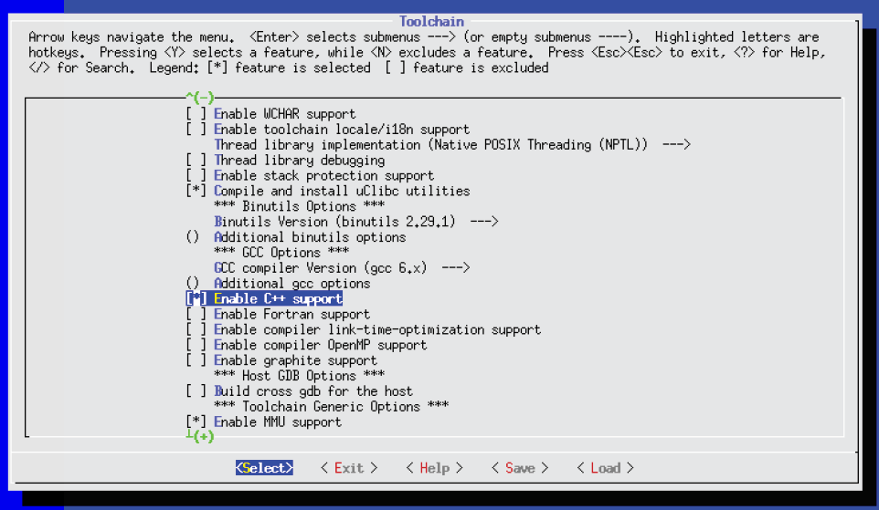
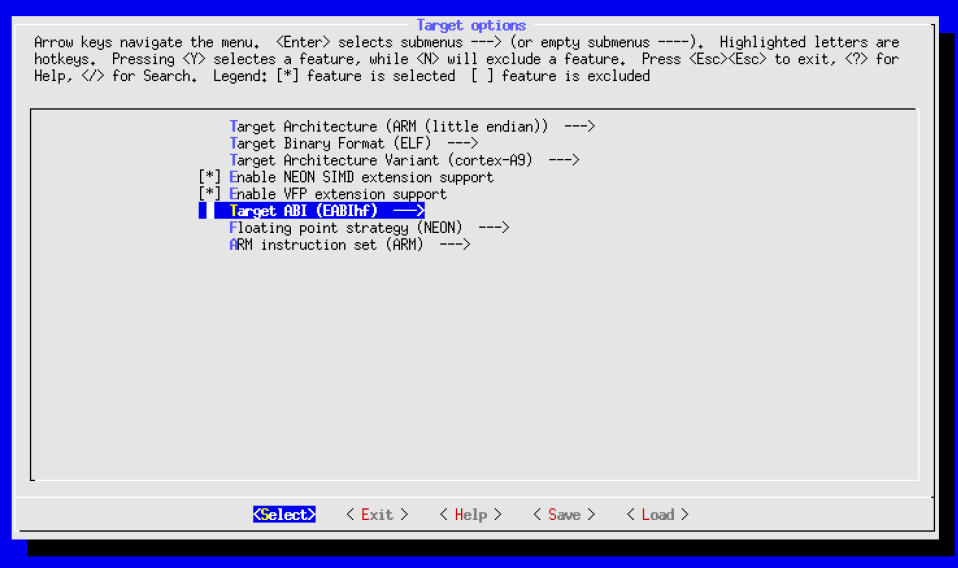
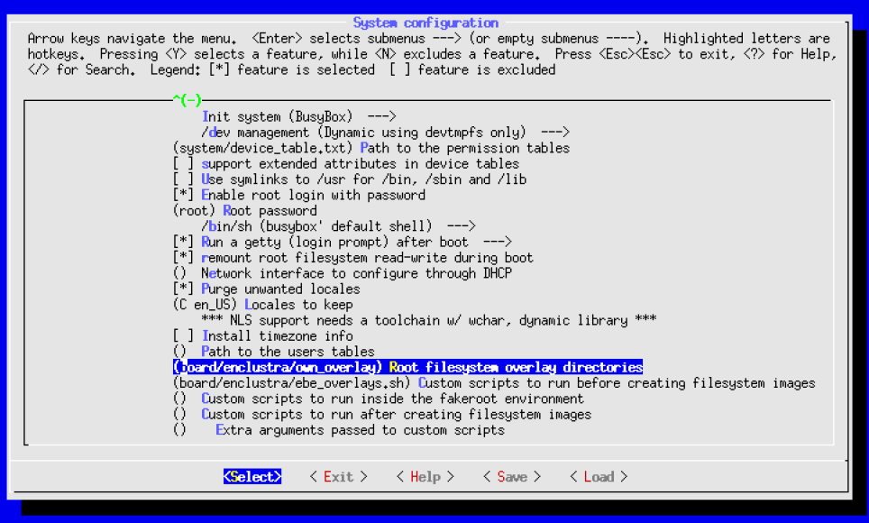

# 4 - Buildroot

## 4.1 - Root file system
The [Enclustra Build Environment (EBE)](https://www.enclustra.com/en/products/tools/linux-build-environment/) uses a root file system (rootfs) generated by Buildroot. Buildroot is a Linux build system which is capable of building rootfs, kernel image, bootloader and the needed cross-compilation toolchain. In EBE Buildroot is only used to build the toolchain and rootfs.

## 4.2 - Folder structure
The following trees show the folder structure starting from the top level directory ([bsp-xilinx](https://github.com/enclustra-bsp/bsp-xilinx) or [bsp-altera](https://github.com/enclustra-bsp/bsp-altera)) of the Enclustra build environment. All paths and files mentioned in this Buildroot section are shown below.

### 4.2.1 - Buildroot for Xilinx devices
```
└── bsp-xilinx/
    └── sources
        ├── xilinx-uboot
        ├── xilinx-linux
        └── buildroot-rootfs
            ├── .config
            ├── Makefile
            ├── configs
            │   ├── enclustra_xilinx_defconfig
            │   ├── enclustra_xilinx_nodhcp_defconfig
            │   ├── enclustra_xilinx_tiny_defconfig
            │   └── enclustra_xilinx_zynqmp_defconfig
            ├── output
            │   ├── target
            │   ├── images
            │   ├── host
            │   │   └── bin
            │   └── build
            │       └── helloworld-1.0
            │           ├── helloworld
            │           ├── helloworld.c
            │           └── Makefile
            ├── board
            │   └── enclustra
            │       └── ebe_overlays.sh
            └── docs
                └── manual
            └── package
                ├── Config.in
                └── helloworld
                    ├── Config.in
                    ├── helloworld.c
                    ├── helloworld.mk
                    └── Makefile
```
### 4.2.2 - Buildroot for Intel devices
```
└── bsp-altera/
    └── sources
        ├── altera-uboot
        ├── altera-linux
        └── buildroot-rootfs
            ├── .config
            ├── Makefile
            ├── configs
            │   ├── enclustra_altera_defconfig
            │   └── enclustra_altera_nodhcp_defconfig
            ├── output
            │   ├── target
            │   ├── images
            │   ├── host
            │   │   └── bin
            │   └── build
            │       └── helloworld-1.0
            │           ├── helloworld
            │           ├── helloworld.c
            │           └── Makefile
            ├── board
            │   └── enclustra
            │       └── ebe_overlays.sh
            └── docs
                └── manual
            └── package
                ├── Config.in
                └── helloworld
                    ├── Config.in
                    ├── helloworld.c
                    ├── helloworld.mk
                    └── Makefile
```
## 4.3 - Configuration
Similar to the Linux kernel (see section [3.2](Chapter-3-Linux-Kernel.md#32---configuration)), there are several ways to generate a configuration for Buildroot. All these configuration tools provide a graphical user interface.

| Command         | Description                                |
|-----------------|--------------------------------------------|
| make menuconfig | The original curses-based configurator     |
| make nconfig    | The new curses-based configurator          |
| make xconfig    | A Qt-based configurator                    |
| make gconfig    | A GTK-based configurator                   |

This section only explains the usage of `make menuconfig`, since it is commonly used. The configuration menu can be started by typing following line in the Buildroot source folder. The Buildroot sources can be found in `<path_to_build_environment>/sources/buildroot-rootfs/` directory.
```
make menuconfig
```
See section [3.2](Chapter-3-Linux-Kernel.md#32---configuration) for more information about the configuration menu. After a configuration was saved, the entire Buildroot configuration is stored in the `.config` file located in the Buildroot source directory.

### 4.3.1 Defconfig files
Similar to the Linux kernel defconfig files (see section [3.2](Chapter-3-Linux-Kernel.md#32---configuration)), Buildroot supports defconfig files as well. All defconfig files can be found in `<path_to_build_environment>/sources/buildroot-rootfs/configs` directory. The following list shows all defconfig files used in the Enclustra build environment for the Enclustra SoC modules.

| File name                         | Description                                                  |
|-----------------------------------|--------------------------------------------------------------|
| enclustra_altera_defconfig        | Default Settings for all Intel SoC                           |
| enclustra_altera_nodhcp_defconfig | Settings for `NET` boot for all Intel SoC                    |
| enclustra_xilinx_defconfig        | Default Settings for all Xilinx Zynq-7000 SoC                |
| enclustra_xilinx_nodhcp_defconfig | Settings for `NET` boot option for all Xilinx SoC            |
| enclustra_xilinx_tiny_defconfig   | Settings for `QSPI` boot option for all Xilinx Zynq-7000 SoC |
| enclustra_xilinx_zynqmp_defconfig | Default settings for all Xilinx Zynq Ultrascale+ MPSoC       |

If needed, new configuration files can be created, containing the desired configuration. Because the build system keeps a specific order for the settings in the defconfig files, it should be avoided to modify a defconfig file by hand. The following command can be used to generate a defconfig file using the current Buildroot configuration.
```
make savedefconfig
```
The location and name of the newly created defconfig file is stored in `BR2_DEFCONFIG` setting. This can be changed in `Build options` submenu in the graphical configuration. In the Enclustra build environment, this setting is set to one of the defconfig files listed in this section, depending on the chosen boot mode
and target module.

### 4.3.1 Build root file system without Enclustra build script
The following listing shows how the root file system is generated without using the build script of the Enclustra build environment.
```
cd <path_to_build_environment>/sources/buildroot−rootfs
make <module>_defconfig
make EBE_OVERLAYS=<overlay_directory>
```
Note that `EBE_OVERLAYS` is optional. It can be used to copy an overlay directory to the rootfs using a post build script. In the build environment build script, the overlay directory is set to the kernel module directory (see section [3.2](Chapter-3-Linux-Kernel.md#32---configuration)). The generated rootfs can be found in the `<path_to_build_environment>/sources/buildrootrootfs/output/images` directory.

## 4.4 - Toolchain
Buildroot builds its own toolchain that is used to cross compile all applications in the root file system. This toolchain can be found in `<path_to_build_environment>/sources/buildroot-rootfs/output/host/usr/bin` directory. This toolchain is recommended for building user applications because the referenced libraries are already present on the target file system.

Note that it is needed to execute `make clean` in the Buildroot source directory
(`<path_to_build_environment>/sources/buildroot-rootfs`) when a build for a new device or a different boot mode is created in the Enclustra build environment. A new device might use a different compiler or settings and the build will fail if the files are already compiled with a different compiler. The same applies if the toolchain is changed, for example by adding C++ support or enabling hard float arithmetic support as described in the following sections.

### 4.4.1 C++ support
By default, the toolchain built by Buildroot does not include a C++ compiler. The libraries to run a C++ application are also missing in rootfs. If this is required, it must be enabled manually in the graphical configuration menu. The corresponding setting can be found in the `Toolchain` submenu as seen in below.



### 4.4.2 Hard float support
By default, the toolchain built by Buildroot uses soft floating point arithmetic. To use the hardware floating point unit, the Buildroot settings need to be changed according to the screenshot below. The setting `Enable VFP extension support` needs to be enabled and `Target ABI` needs to be changed to `EABIhf`. Both settings can be found in the `Toolchain` submenu.



## 4.5 - File system modification
At some point in development it might be needed to store additional files in the root file system. There are several possible ways to do that - these are presented below.

The target filesystem is located in the `<path_to_build_environment>/sources/buildroot-rootfs/output/target` directory. It is possible to modify the filesystem in that directory. After making changes, run `make` to rebuild the target filesystem image. Changes made to this directory will be lost after executing `make clean`, therefore this method is only recommended for quick tests. Note that the `<path_to_build_environment>/sources/buildroot-rootfs/output/target` folder does not contain the complete target filesystem. The device files in `/dev` are missing because Buildroot cannot create them. Therefore, only the compressed output files in the `<path_to_build_environment>/sources/buildroot-rootfs/output/images` directory should be used as the target root file system.

A second way to modify the target filesystem is to specify an overlay directory. A filesystem overlay is a tree of files that is copied directly over the target filesystem after it has been built. Hidden directories of version control systems, like .git, .svn, etc. are excluded from the copy. The overlay can be enabled in `System configuration` submenu of the graphical configuration menu as shown in the screenshot below. The recommended path for this overlay is `<path_to_build_environment>/board/<company>/<boardname>/rootfs-overlay`.



A third way is to use a post-build script. In the Enclustra build environment, a post-build script is already used to copy the kernel modules to the root file system. Post-build scripts can be set in the `System configuration` submenu of the graphical configuration menu. This can also be seen in the screenshot, right below the overlay setting.

## 4.6 - Init system
By default, the Enclustra build environment uses BusyBox and its init program (`/sbin/init`). The init program is the first user space application that is started by the kernel and is responsible to start all user space services and programs.

The `/sbin/init` program calls the `/etc/init.d/rcS` script which executes all startup scripts located in `/etc/init.d/` directory with the `start` option. The name of all startup scripts starts with `S` followed by a two digit number. These scripts are executed in ascending order depending on the number. After `rcS` finishes, the system should be up and running. Additional scripts can be added to automatically start a user created service when Linux finishes booting. Here is an example script which executes the program `helloworld.elf`:
```sh
#!/bin/sh

case ”$1” in
    start)
        ./helloworld.elf &
        ;;

    stop)
        ;;

    restart|reload)
        ”$0” stop
        ”$0” start
        ;;

    *)
        echo ”Usage: $0 {start|stop|restart}”
        exit 1
esac

exit $?
```

## 4.7 - Create a custom application
This section describes how to build a simple hello world application to be executed in the Linux system running on the Enclustra module.
```c
#include <stdio.h>

int main()
{
    printf(”Hello World”);
}
```

### 4.7.1 - Create a Hello World application in Xilinx SDK on Linux
It is recommended to use the toolchain built by Buildroot to cross compile an application on a Linux host machine. The following example shows how to create and compile a hello world example project in Xilinx SDK using the toolchain built by Buildroot.
* Add the directory of the toolchain to the `PATH` variable (e.g. `export PATH=$PATH:<path_to_build_environment>/sources/buildroot-rootfs/output/host/usr/bin`)
* Run Xilinx SDK settings script to prepare the environment (e.g. `source /opt/Xilinx/SDK/2018.2/settings64.sh`)
* Start Xilinx SDK by typing: `xsdk`
* Select a directory as a workspace
* Create a new project: `File -> New -> Application Project`
* Set a project name (e.g. `helloworld`)
* Set `OS Platform` to `linux` and select `Processor type` according to the used Enclustra module:
    - For modules equipped with a Xilinx Zynq Ultrascale+ MPSoC: select `psu_cortexa53`
    - For modules equipped with a Xilinx Zynq-7000 SoC: select `ps7_cortexa9`
* Click `Next`, select `Linux Hello World` as the template and click `Finish`
* In the `Project Explorer`, right click on the newly generated project and select `Properties`
* Navigate to `C/C++ Build -> Settings` and change the toolchain command to use the toolchain generated by Buildroot.
    
    For modules equipped with a Xilinx Zynq Ultrascale+ MPSoC:
    - Change `ARM v8 Linux gcc assembler` command to `aarch64-buildroot-linux-gnu-gcc`
    - Change `ARM v8 Linux gcc compiler` command to `aarch64-buildroot-linux-gnu-gcc`
    - Change `ARM v8 Linux gcc linker` command to `aarch64-buildroot-linux-gnu-gcc`
    - Change `ARM v8 Linux Print Size` command to `aarch64-buildroot-linux-gnu-size`

    For modules equipped with a Xilinx Zynq-7000 SoC:

    - Change `ARM v7 Linux gcc assembler` command to `arm-buildroot-linux-gnu-gcc`
    - Change `ARM v7 Linux gcc compiler` command to `arm-buildroot-linux-gnu-gcc`
    - Change `ARM v7 Linux gcc linker` command to `arm-buildroot-linux-gnu-gcc`
    - Change `ARM v7 Linux Print Size` command to `arm-buildroot-linux-gnu-size`

    Note that the toolchain prefix needs to be set according to the toolchain available in the `<path_to_build_environment>/sources/buildroot-rootfs/output/host/usr/bin` directory. For example if hard float support was added, the toolchain prefix changes to `<arch>-buildroot-linux-gnueabi-`.
* Click `OK` to save the settings
* Hit Ctrl-B to build the application
* The built binary can be found in the selected workspace folder (e.g. `<workspace>/helloworld/Debug/helloworld.elf`)
* Copy the newly generated binary file to the target filesystem as described in section [4.9](Chapter-4-Buildroot.md#49---copy-files-to-root-file-system) or section [4.5](Chapter-4-Buildroot.md#45---file-system-modification)
* On the target Linux change the permissions of the application to be able to execute it (`chmod +x helloworld.elf`)
* Start the hello world application by typing `./helloworld.elf`
### 4.7.2 - Create a Hello World application in Xilinx SDK on Windows
When an application is cross compiled on a Windows host machine, the toolchain generated by Buildroot cannot be used. Xilinx SDK provides its own toolchain which uses hard floating point arithmetic. Therefore the target root file system needs to be built also with a hard float toolchain. The following example shows how to create a hello world example project in Xilinx SDK:

**Prepare the root file system and toolchain**

* Create a Linux build in the Enclustra build environment
* Navigate to the Buildroot source directory (`cd <path_to_build_environment>/sources/buildroot-rootfs`)
* Open the configuration menu by typing `make menuconfig`
* Change the compiler settings to build the correct toolchain and libraries
    For modules equipped with a Xilinx Zynq-7000 SoC, hard floating point arithmetic support needs to be enabled.
    - Navigate to the `Target Options` submenu and enable `Enable VFP extension support`. For `Target ABI` settings, select `EABIhf`.
    - Navigate to the `Toolchain` submenu and enable `Enable C++ support`.
* Exit configuration menu and save changed configuration
* Clean all built files by typing `make clean` in the Buildroot source directory
* Rebuild the toolchain and rootfs by executing the build script (`build.sh`). Note that the setting `Load initial Buildroot configuration` needs to be disabled. Otherwise the changed configuration will be overwritten.

**Create and run an application**

* Start Xilinx SDK
* Select a directory as workspace
* Create a new project: `File -> New -> Application Project`
* Enter a project name (e.g. helloworld)
* Set OS Platform to `linux`, select `Processor type` according to the used Enclustra module:
    - For modules equipped with a Xilinx Zynq Ultrascale+ MPSoC: Select `psu_cortexa53`
    - For modules equipped with a Xilinx Zynq-7000 SoC: Select `ps7_cortexa9`
* Click `Next >`, select `Linux Hello World` as template and click `Finish`
* Hit Ctrl-B to build the project
* The built binary can be found in the selected workspace folder (e.g. `<workspace>/helloworld/Debug/helloworld.elf`)
* Copy the newly generated binary file to the target filesystem as described in section [4.9](Chapter-4-Buildroot.md#49---copy-files-to-root-file-system) or section [4.5](Chapter-4-Buildroot.md#45---file-system-modification)
* On the target Linux change the permissions of the application to be able to execute it (`chmod +x helloworld.elf`)
* Start the helloworld application by typing `./helloworld.elf`

### 4.7.3 - Create a Hello World application in Intel ARM DS-5 on Linux
It is recommended to use the toolchain built by Buildroot to cross compile an application on a Linux host machine. The following example shows how to create and compile a hello world example project in ARM DS-5 using the toolchain built by Buildroot.
* Add the directory of the toolchain to the `PATH` variable (e.g. `export PATH=$PATH:<path_to_build_environment>/sources/buildroot-rootfs/output/host/usr/bin`)
* Open the Intel SoC EDS command shell (e.g. `/opt/intelFPGA/18.0/embedded/embedded_command_shell.ch`)
* Start ARM DS-5 by typing `eclipse`
* Select a directory as workspace
* Create a new project: `File -> New -> C Project`
* Enter a project name (e.g. helloworld)
* Select `Hello World ANSI C Project` as project type and `Linux GCC` as toolchain
* Click `Finish`
* Right click on the newly created project in the `Project Explorer` and select `Properties`
* Navigate to `C/C++ Build -> Settings` and change the toolchain command to use the toolchain generated by Buildroot
    - Set `GCC C Compiler` command to `arm-buildroot-linux-gnu-gcc`
    - Set `GCC C Linker` command to `arm-buildroot-linux-gnu-gcc`
    - Set `GCC Assembler` command to `arm-buildroot-linux-gnu-as`
    Note that the toolchain prefix needs to be set according to the toolchain available in `<path_to_build_environment>/sources/buildroot-rootfs/output/host/usr/bin` directory. For example if hard float support was added, the toolchain prefix changes to `arm-buildroot-linux-gnueabi-`.
* Click `OK` to save the settings
* Hit Ctrl-B to build the application
* The built binary can be found in the selected workspace folder (e.g. `<workspace>/helloworld/Debug/helloworld`)
* Copy the newly generated binary file to the target file system as described in section [4.9](Chapter-4-Buildroot.md#49---copy-files-to-root-file-system) or section [4.5](Chapter-4-Buildroot.md#45---file-system-modification)
* On the target Linux: Change the permissions of the application to be able to execute it (`chmod +x helloworld`)
* Start the hello world application by typing `./helloworld`

### 4.7.4 - Create a Hello World application in Intel ARM DS-5 on Windows
When an application is cross compiled on a Windows host machine, the toolchain generated by Buildroot cannot be used. The toolchain provided by Intel SoC EDS uses hard floating point arithmetic. Therefore the target root file system needs to be built also with a hard float toolchain. The following example shows how to create and compile a hello world example project in ARM DS-5.

**Prepare Root File System and Toolchain**
* Create a Linux build in the Enclustra build environment
* Add hard floating point arithmetic support. Open the configuration menu by typing `make menuconfig` in Buildroot source directory (see section [4.3](Chapter-4-Buildroot.md#43---configuration)). Navigate to `Target Options` submenu and enable `Enable VFP extension support`. For `Target ABI` settings, select `EABIhf`.
* Navigate to the `Toolchain` submenu and enable `Enable C++ support`
* Exit configuration menu and save changed configuration
* Clean all built files by typing `make clean` in Buildroot source directory
* Rebuild the toolchain and rootfs by executing the build script (build.sh). Note that the setting `Load initial Buildroot configuration` needs to be disabled. Otherwise the configuration will be overwritten. 

**Create and Run an Application**

* To start ARM DS-5 open `SoC EDS Command Shell` and type:
  ```
  eclipse
  ```
* Select a directory as workspace
* Create a new project: `File -> New -> C Project`
* Enter a project name (e.g. helloworld)
* Select `Hello World ANSI C Project` as project type and select `GCC 4.x[arm-linux-gnueabihf]` as toolchain
* Click `Finish`
* Hit Ctrl-B to build the project
* The built binary can be found in the selected workspace folder (e.g. <workspace>/helloworld/Debug/helloworld)
* Copy the newly generated binary file to the target filesystem as described in section [4.9](Chapter-4-Buildroot.md#49---copy-files-to-root-file-system) or section [4.5](Chapter-4-Buildroot.md#45---file-system-modification)
* On the target Linux: Change the permissions of the application to be able to execute it (`chmod +x helloworld`)
* Start the helloworld application by typing `./helloworld`

### 4.7.5 - Create a Hello World application without a SDK
The toolchain built by Buildroot, located in the `<path_to_build_environment>/sources/buildroot-rootfs/output/host/usr/bin` directory, can be used to compile an application in Linux without having to use a software development kit. The application can be compiled by using a simple Makefile. The procedure is described below.
* Create a simple hello world application as described in section [4.7](Chapter-4-Buildroot.md#47---create-a-custom-application) and name it `helloworld.c`
* Create a Makefile as described below and store it in the same directory as the helloworld.c source file.
  ```
  ARCH=arm
  CROSS_COMPILE=<path_to_build_environment>/sources/buildroot−rootfs/output/host/usr/bin/arm−buildroot−linux−eabi−
  CC=$(CROSS_COMPILE)gcc
  
  all: helloworld
  
  helloworld : helloworld.c
  $(CC) $^ −o $@
  
  .PHONY: clean
  clean:
  rm −f *.o helloworld
  ```
* Set the `ARCH` variable inside the Makefile according to the architecture of the target module (`arm` for Enclustra modules equipped with Intel or Xilinx Zynq-7000 SoC or `arm64` for Enclustra modules equipped with Xilinx Zynq Ultrascale+ MPSoC)
* Set the cross compile prefix inside the Makefile to the correct value
* Navigate to the directory containing the source file and the Makefile, and type `make` to generate the executable binary
* Copy the newly generated binary file to the target filesystem as described in section [4.9](Chapter-4-Buildroot.md#49---copy-files-to-root-file-system) or section [4.5](Chapter-4-Buildroot.md#45---file-system-modification)
* On the target Linux: Change the permissions of the application to be able to execute it (`chmod +x helloworld`)
* Start the helloworld application by typing `./helloworld`
### 4.7.6 - Add custom applications as package
A custom application can be added as a package to Buildroot. This allows the user to enable/disable the application and to build it in the Buildroot build flow. Usually the package sources are downloaded during the build. For simplicity, the following steps describe how to add a package only with local source files.
* Create a new directory in `<path_to_build_environment>/sources/buildroot-rootfs/package/`
  ```
  cd <path_to_build_environment>/sources/buildroot−rootfs/package/
  mkdir helloworld
  ```
* Create a simple hello world application as described in section [4.7](Chapter-4-Buildroot.md#47---create-a-custom-application) and name it `helloworld.c`
* Create the `helloworld.mk` file with following content:
  ```mk
  ################################################################################
  #
  # helloworld
  #
  ################################################################################
  
  HELLOWORLD_VERSION = 1.0
  HELLOWORLD_SOURCE =
  HELLOWORLD_SITE =
  HELLOWORLD_ARCH = $(if $(BR2_i386),i386)$(if $(BR2_x86_64),x86_64)
  HELLOWORLD_LICENSE = GPL
  HELLOWORLD_LICENSE_FILES = LICENCE
  
  define HELLOWORLD_BUILD_CMDS
  cp −f package/helloworld/Makefile $(@D)
  cp −f package/helloworld/helloworld.c $(@D)
  $(TARGET_CONFIGURE_OPTS) make −C $(@D) $(HELLOWORLD_ARCH)
  endef
  
  define HELLOWORLD_INSTALL_TARGET_CMDS
  $(INSTALL) −m 0755 −D $(@D)/helloworld $(TARGET_DIR)/usr/bin/helloworld
  endef
  
  $(eval $(generic−package))
  ```
    Note that `$(@D)` describes the build directory of the helloworld application (`<path_to_build_environment>/sources/buildroot-rootfs/output/build/helloworld-1.0`). The Makefile and the c source file are copied into the build directory before the Makefile is executed. `HELLOWORLD_SOURCE` and `HELLOWORLD_SITE` are used to set the download path and file name, but because this example only uses local files, these two variables are empty.
* Create the Makefile with following content:
  ```mk
  all: helloworld

  helloworld: helloworld.c
  $(CC) $(CFLAGS) $(LDFLAGS) $^ −o $@
  
  clean:
  rm −f *.o helloworld
  ```
* Create a new file `Config.in` with following content. The syntax is the same as for Linux kernel Kconfig files (see section [3.4](Chapter-3-Linux-Kernel.md#34---create-and-add-a-custom-driver)).
  ```
  config BR2_PACKAGE_HELLOWORLD
    bool ”helloworld”
    help
        This is a test application.
  ```
* Add a reference to the newly generated `Config.in` file to the overlaying `Config.in` file located in `<path_to_build_environment>/sources/buildroot-rootfs/package/` directory by adding following line to the overlaying `Config.in` file:
  ```sh
  source ”package/helloworld/Config.in”
  ```
When `make menuconfig` is started, the newly added application can be found in `Target packages` submenu. When the application is enabled, the modified configuration is saved and rootfs is rebuilt by typing `make`, the new application `helloworld` can be found in `/usr/bin` directory on the target file system. It can be started by typing `helloworld`.

## 4.8 - Debug a custom application

### 4.8.1 - Start a debug session in Xilinx SDK
Xilinx provides a System Debugger (TCF) which needs a software (tcf-agent) running on the target Linux. This software is built by default when a Linux build is generated in the Enclustra build environment with default configuration. The needed setting can be found in the Buildroot configuration menu in the `Target packages -> Debugging, profiling and benchmark` submenu.

**Prepare Target Linux**

* Create a Linux build as described in section [4.7.2](Chapter-4-Buildroot.md#472---create-a-hello-world-application-in-xilinx-sdk-on-windows)
* Connect the Enclustra module via Ethernet to the host machine
* Boot Linux on the module
* Configure an IP address. For example:
  ```sh
  ifconfig eth0 192.168.1.10
  ```
* Start Xilinx TCF agent:
  ```sh
  tcf−agent &
  ```

**Create Application and Start Debugging**

* Open Xilinx SDK
* Create a Linux application as described in section [4.7.2](Chapter-4-Buildroot.md#472---create-a-hello-world-application-in-xilinx-sdk-on-windows)
* Open `Run -> Debug Configurations`
* Click `Xilinx C/C++ application (System Debugger)` to create a new configuration
* Select the `Target Setup` tab
* From the drop down list `Debug Type` select `Linux Application Debug`
* Click `New` to create a new connection
* Enter the IP address of the target module to the `Host` field and set a name for the target. Set the Port to `1534`.
* Click `Test connection` to check if SDK is able to connect to the tcf-agent application running on the target Linux
* Click `Ok` and select the `Application` tab
* Set the project to debug and optionally the working directory (the path to download the application to the target file system)
* Click `Apply`
* Start debugging by pressing `Debug`

### 4.8.2 - Start a debug session in Intel ARM DS-5
The following example provides instructions on how to start a debugging session in ARM DS-5 using GDB debugger.

**Prepare Target Linux**

* Create a Linux build with hard floating point arithmetic support as described in section [4.7.4](Chapter-4-Buildroot.md#474---create-a-hello-world-application-in-intel-arm-ds-5-on-windows)
* Connect the Enclustra module via Ethernet to the host machine
* Boot Linux on the target module
* Create a new user as described in section [4.10.1](Chapter-4-Buildroot.md#4101---create-a-new-user). This user will be used for login via SSH because root user is not permitted.
* Restart the SSH daemon to initialize with the newly created user or reboot Linux
  ```
  start−stop−daemon −K −x /usr/sbin/sshd
  start−stop−daemon −S −x /usr/sbin/sshd
  ```
* Configure an IP address. For example:
  ```sh
  ifconfig eth0 192.168.1.10
  ```
**Create application and start debugging**
* To start ARM DS_5 open `SoC EDS Command Shell` and type:
  ```
  eclipse
  ```
* Create a Linux application as described in section [4.7.4](Chapter-4-Buildroot.md#474---create-a-hello-world-application-in-intel-arm-ds-5-on-windows)
* Open debug view: `Window -> Open Perspective -> DS-5 Debug`
* In `Remote Systems` tab: Click on `Define a connection to remote system`
* A new window opens. Select `SSH Only` and click `Next >`
* For `Host name` enter the IP address of the running Linux system: (e.g. `192.168.1.10`) and press `Finish`
* The added connection is now visible in `Remote Systems` tab. Click on `Sftp Files` -> `My Home` and enter the credentials of the previously created user.
* Open `Run -> Debug Configurations...`
* Create a new `DS-5 Debugger` configuration by double clicking on `DS-5 Debugger`
* In `Connection` tab, `Select target` select the device of the used Enclustra module (e.g. `Cyclone V SoC (Dual Core) -> Linux Application Debug -> Download and debug application`)
* In `Files` tab, select the binary to debug (e.g. <workspace>/helloworld/Debug/helloworld”) and the target download directory (e.g. /home/<user>)
* Press `Apply` and `Debug` to start debugging

## 4.9 - Copy files to root file system
This section describes several ways to copy files from a host machine to the target Linux. Besides the methods listed here, files can also be copied directly to the root file system when the rootfs is been built (see section [4.5](Chapter-4-Buildroot.md#45---file-system-modification)).

### 4.9.1 - TFTP
**TFTP Client on Target Linux**

Per default, the Busybox TFTP client is available on the target Linux. To get a file from a TFTP server, the following command can be used.
```sh
tftp −g −r <filename> <IPAddressOfTFTPServer>
```

**TFTP Server on Windows Host**

Many TFTP servers exist for a Windows host. An example of a free TFTP server is [OpenTFTPServer](https://sourceforge.net/projects/tftp-server/). After the installation has completed, a folder was created and all files inside this folder are remote accessible via TFTP.

**TFTP Server on Linux Host**

On a Linux host `tftpd` can be used as TFTP server. The following procedure was verified on a Ubuntu 16.04 host machine. The same procedure should also work with other Linux distributions.
* Create a new directory `/tftp_access_dir`. This folder will be used for file transfer.
  ```sh
  sudo mkdir /tftp_access_dir
  sudo chown nobody /tftp_access_dir
  ```
* Create a new file `/etc/xinetd.d/tftp` with following content:
  ```
  service tftp
  {
    protocol = udp
    port = 69
    socket_type = dgram
    wait = yes
    user = nobody
    server = /usr/sbin/in.tftpd
    server_args = /tftp_access_dir
    disable = no
  }
  ```

* Restart the service using following command:
  ```sh
  sudo /etc/init.d/xinetd restart
  ```
* At this point, the TFTP server is running and each file in `/tftp_access_dir` directory is remote accessible via TFTP.

### 4.9.2 - SSH
To have SSH access to the target module, the user first needs to create a new user as described in section [4.10.1](#4101CreateANewUser). On a Windows host `PuTTY SCP` or any Cygwin environment like Intel SoC EDS command shell can be used. On a Linux host, the following command can be used to copy a file to the target Linux:
```
scp <LocalFileToCopy> <TargetUser>@<IpAddressOfTargetModule>:<PathOfNewFileInTargetModule>
```

### 4.9.3 - USB / Boot partition
If available, files can be copied to a partition of a USB flash device or to the boot partition of the SD card. The partition needs to be mounted in Linux in order to have access to it. Execute the following commands to mount the boot partition to the newly created `mount_folder` folder. Note that the device might be different if the module is equipped with more than one MMC device (for example with an eMMC flash).
```sh
mkdir mount_folder
mount /dev/mmcblk0p1 mount_folder
```
To remove the mounted folder, execute:
```sh
umount mount_folder
```

## 4.10 - Useful commands

### <a name="4101CreateANewUser"></a>4.10.1 - Create a new user
If the newly created user is used for SSH access, the date in Linux needs to be set before the user is created (at boot the time is set per default to 1.Jan.1970). Otherwise, the SSH connection will be refused due to the time difference between host and target Linux.
```sh
date −s ’2018−09−25 12:00:00’
```
By default, only the root user is created. A new user can be added with following command:
```sh
mkdir /home
adduser <NameOfNewUser>
```
Note that the `/home` directory needs to be present because a home folder for the newly added user will be created at `/home/<NameOfNewUser>`.

### 4.10.2 - Change user password
The default password for root user is `root`. The following command is used to change the password for root or any other user:
```sh
passwd <NameOfUser>
```
The password for `root` user can also be changed using `make menuconfig`. The setting can be found in `System configuration` submenu.

## 4.11 - Additional information
* [Buildroot user manual](https://buildroot.org/downloads/manual/manual.html)